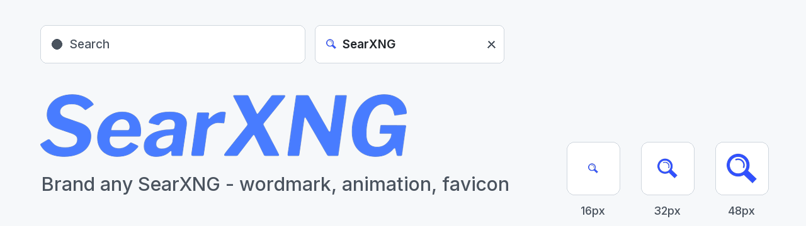
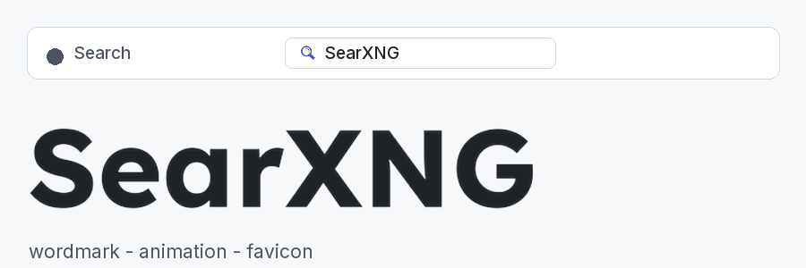
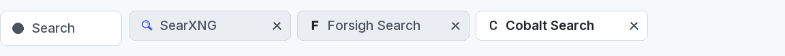
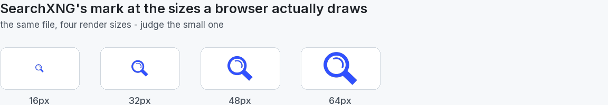
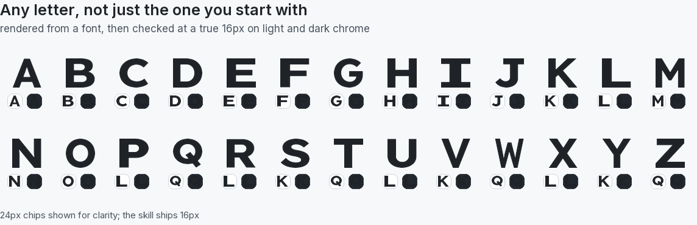
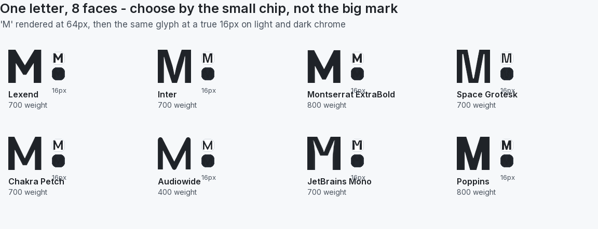
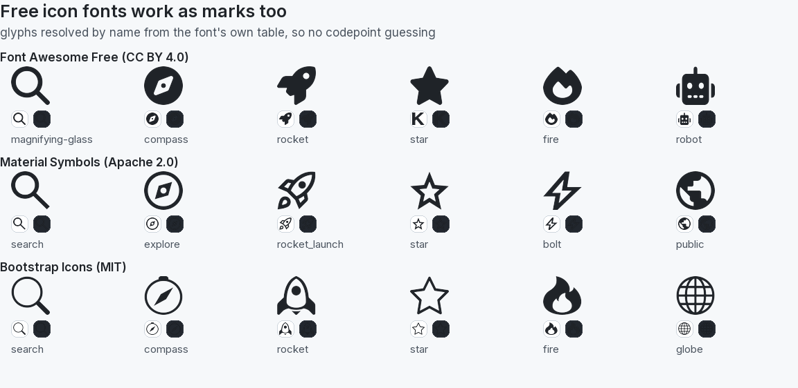

# searxng-custom-logo



An Agent Skill for **branding a self-hosted SearXNG** - wordmark, animated front page, results
mark, and a favicon that survives both browser themes.

Written for an agent to read mid-task: the traps first, the theory second, and a verification step
for every claim that would otherwise be taken on faith.

## What it looks like

The same engine, rebranded. SearXNG's own wordmark ripples and resolves into a custom one in a
single left-to-right pass, with the amplitude at zero at both ends so the loop never jumps:



One engine, several identities. Every mark below is rendered by this skill's own `make_mark.py`,
and every favicon is shown at a true 16 pixels:



## Install

Hermes, straight from this repo - this fetches the whole skill, hub plus references plus scripts:

```bash
hermes skills install https://raw.githubusercontent.com/Forsigh/searxng-custom-logo/main/skills/searxng-custom-logo/SKILL.md --yes
```

Or add the repo as a skill source and install from there:

```bash
hermes skills tap add Forsigh/searxng-custom-logo
```

Any other harness: copy `skills/searxng-custom-logo/` into wherever your skills live. The format
is plain Agent Skills - `SKILL.md` with frontmatter, plus `references/` and `scripts/`.

## What it covers

Deploying a logo to a containerised SearXNG has five traps that each present as "the logo is
broken" for a different reason:

- a new filename that is invisible until it is mounted into the container
- a stale `Content-Length` that aborts every request until the container restarts
- a missing `?v=` bump that leaves browsers on old CSS pointing at a deleted file
- CSS rules silently dropped by the asset's own trailing braces
- precompressed siblings still serving the previous image

The skill walks all five, then covers the parts that actually take the time: measuring which size
the page really draws, making an animated effect legible at that size, building an animated WebP
that plays, and a favicon that holds up against both light and dark browser chrome.

The same file, as the browser actually draws it. Most favicon work is judging the small one:



## Picking a mark

Any letter, not just the one you start with - A to Z rendered from a font, then checked at a real
16 pixels against both light and dark chrome:



One letter across eight faces. A typeface's personality lives in the large mark; at favicon size
what survives is the letter and its weight, which is exactly why you choose by the small chip:



Prefer a real icon to a letter? Free icon fonts work through the same pipeline. Glyphs are
resolved by name from the font's own table rather than a hardcoded codepoint, so a font update
cannot silently swap your mark for a different picture - and no SVG rasteriser is involved:



## Scripts

- **`make_mark.py`** - render a glyph or short word from any font as a transparent SVG mark plus
  PNG fallbacks, optionally with an embedded `prefers-color-scheme` ink switch.
- **`font_contact_sheet.py`** - contact sheet of candidate typefaces at real render sizes, so a
  face is chosen by how it looks at 16px rather than at poster size.
- **`icon_glyph.py`** - resolve an icon by name from an icon font's own cmap, then hand it to
  `make_mark.py`; converts woff2 to ttf when a set only ships woff2.
- **`verify_deploy.py`** - check that every asset your compose file mounts is really being served:
  byte for byte, with a matching `Content-Length`, consistent `.br`/`.gz` siblings, and a `?v=`
  stamp on every reference. It reads the mounts rather than the directory, so files you keep but
  never deploy are reported as hygiene, not as failures.
- **`theme_patch.py`** - re-apply a theme patch after a SearXNG update, idempotently: insert CSS
  after the rule it overrides, and restamp the stylesheet link. It refuses the two cases that fail
  silently - a selector that no longer exists, and one whose rule sits inside an unclosed block,
  where the parser drops the insert without complaining.

None of them bundles fonts or artwork: pass your own, under its licence.
`references/fonts-and-licensing.md` covers what the OFL and Apache licences do and do not permit,
and why a rendered glyph outline is the safe way to ship a wordmark.

## Layout

```
skills/searxng-custom-logo/SKILL.md      the always-loaded hub: rules, quick start, routing table
skills/searxng-custom-logo/references/   depth, loaded only when the hub routes you there
skills/searxng-custom-logo/scripts/      runnable helpers
```

## Licence

MIT - see `LICENSE`. The skill ships no font files; typeface licences remain the user's to accept.

The preview images show SearXNG's own wordmark and magnifier icon; that artwork belongs to the
SearXNG project and appears here to demonstrate the skill against the real thing. Forsigh Search
and Cobalt Search are invented for the demo and rendered by the skill's own `make_mark.py`.

The icon sheet draws from three free sets, each under its own terms: Font Awesome Free (icons
CC BY 4.0, font SIL OFL), Material Symbols (Apache 2.0) and Bootstrap Icons (MIT). No font files
are redistributed here.
