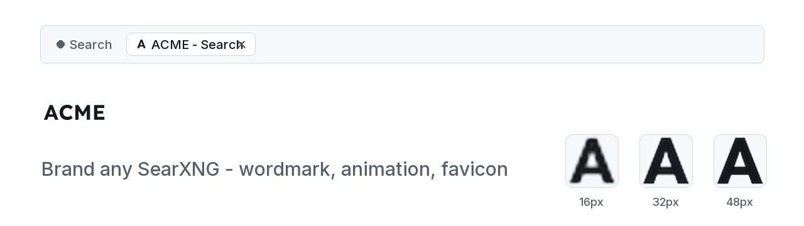
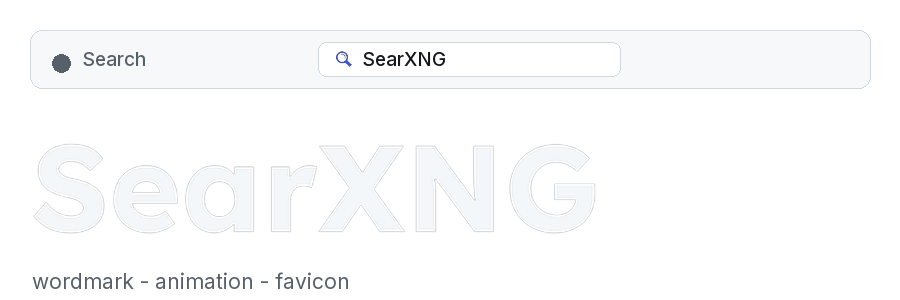
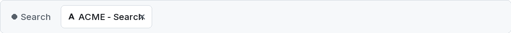
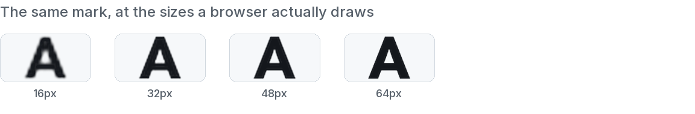

# searxng-custom-logo

<picture>
  <source media="(prefers-color-scheme: dark)" srcset="assets/hero-dark.png">
  <source media="(prefers-color-scheme: light)" srcset="assets/hero-light.png">
  
</picture>

An Agent Skill for **branding a self-hosted SearXNG** - wordmark, animated front page, results
mark, and a favicon that survives both browser themes.

Written for an agent to read mid-task: the traps first, the theory second, and a verification step
for every claim that would otherwise be taken on faith.

## What it looks like

The same engine, rebranded: SearXNG's own wordmark ripples and resolves into a custom one in a
single pass, left to right:

<picture>
  <source media="(prefers-color-scheme: dark)" srcset="assets/demo-dark.gif">
  <source media="(prefers-color-scheme: light)" srcset="assets/demo-light.gif">
  
</picture>

## Install

Hermes, straight from this repo - this fetches the whole skill, hub plus references plus scripts:

```bash
hermes skills install https://raw.githubusercontent.com/Forsigh/searxng-custom-logo/main/skills/searxng-custom-logo/SKILL.md --yes
```

Or add the repo as a skill source and install from there:

```bash
hermes skills tap add Forsigh/searxng-custom-logo
```

Any other harness: copy `skills/searxng-custom-logo/` into wherever your skills live. The format
is plain Agent Skills - `SKILL.md` with frontmatter, plus `references/` and `scripts/`.

## What it covers

Deploying a logo to a containerised SearXNG has five traps that each present as "the logo is
broken" for a different reason:

- a new filename that is invisible until it is mounted into the container
- a stale `Content-Length` that aborts every request until the container restarts
- a missing `?v=` bump that leaves browsers on old CSS pointing at a deleted file
- CSS rules silently dropped by the asset's own trailing braces
- precompressed siblings still serving the previous image

The skill walks all five, then covers the parts that actually take the time: measuring which size
the page really draws, making an animated effect legible at that size, building an animated WebP
that plays, and a favicon that holds up against both light and dark browser chrome.

<picture>
  <source media="(prefers-color-scheme: dark)" srcset="assets/tabs-dark.png">
  <source media="(prefers-color-scheme: light)" srcset="assets/tabs-light.png">
  
</picture>

<picture>
  <source media="(prefers-color-scheme: dark)" srcset="assets/sizes-dark.png">
  <source media="(prefers-color-scheme: light)" srcset="assets/sizes-light.png">
  
</picture>

## Scripts

- **`make_mark.py`** - render a glyph or short word from any font as a transparent SVG mark plus
  PNG fallbacks, optionally with an embedded `prefers-color-scheme` ink switch.
- **`font_contact_sheet.py`** - contact sheet of candidate typefaces at real render sizes, so a
  face is chosen by how it looks at 16px rather than at poster size.

Neither bundles fonts: pass your own, under its licence. `references/fonts-and-licensing.md`
covers what the OFL and Apache licences do and do not permit, and why a rendered glyph outline is
the safe way to ship a wordmark.


## Layout

```
skills/searxng-custom-logo/SKILL.md      the always-loaded hub: rules, quick start, routing table
skills/searxng-custom-logo/references/   depth, loaded only when the hub routes you there
skills/searxng-custom-logo/scripts/      runnable helpers
```

## Licence

MIT - see `LICENSE`. The skill ships no font files; typeface licences remain the user's to accept.

The preview images show SearXNG's own wordmark and magnifier icon; that artwork belongs to the
SearXNG project and appears here to demonstrate the skill against the real thing. Forsigh Search
and Cobalt Search are invented for the demo and rendered by the skill's own `make_mark.py`, so
every mark in these images is something the tooling actually produces.
